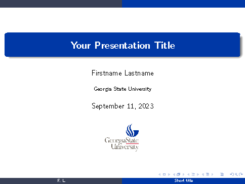

# GSU_beamer_template
A LaTeX Beamer template featuring Georgia State University

## Description
The purpose for this template is to create "neatly organized," "concisely presented," and "aesthetically pleasing" slides while helping the presenter focus more on the content instead of the format.

The template uses:
- [GSU primary logo](https://commkit.gsu.edu/university-logos/#primary) and [GSU color palette](https://commkit.gsu.edu/website-management/web-color-guidelines/).

- *Warsaw* theme (alternatively: *Copenhagen*)
- *serif* font only for math expressions
- *structurebold* font for "large text" such as the main title, frame titles, and section entries in the table of contents.
- *infolines* outertheme (alternatively: *default*, *miniframes*, *split*, *shadow*)
- *circles* innertheme
- modified footline for each frame

## Usage
1. Clone the repository. (Or download `.zip` file from github website and unzip the file locally.)
2. Edit and run the `GSU_beamer_template.tex` file.

Note: You should obtain your own university logo permission if necessary although it is included in this repo.

## Suggestions
1. The [manual for beamer class](http://mirrors.ctan.org/macros/latex/contrib/beamer/doc/beameruserguide.pdf) is always a good reference when making beamer slides.
2. Concentrate on the content of your presentation first. 
3. Think about the frame format of the slides after you have decided on the key points of the presentation.

## Adapt to Your Organization Theme
You can easily adapt the template to feature your own organization by changing the logo and color palette.

## License

The template itself is licensed under a [Creative Commons Attribution-ShareAlike 4.0 International License](http://creativecommons.org/licenses/by-sa/4.0/). This means that if you modify the template and redistribute it, you must retain the copyright notice header and re-license it under the same CC-BY-SA license. This does not affect the presentation that you create with the template.
